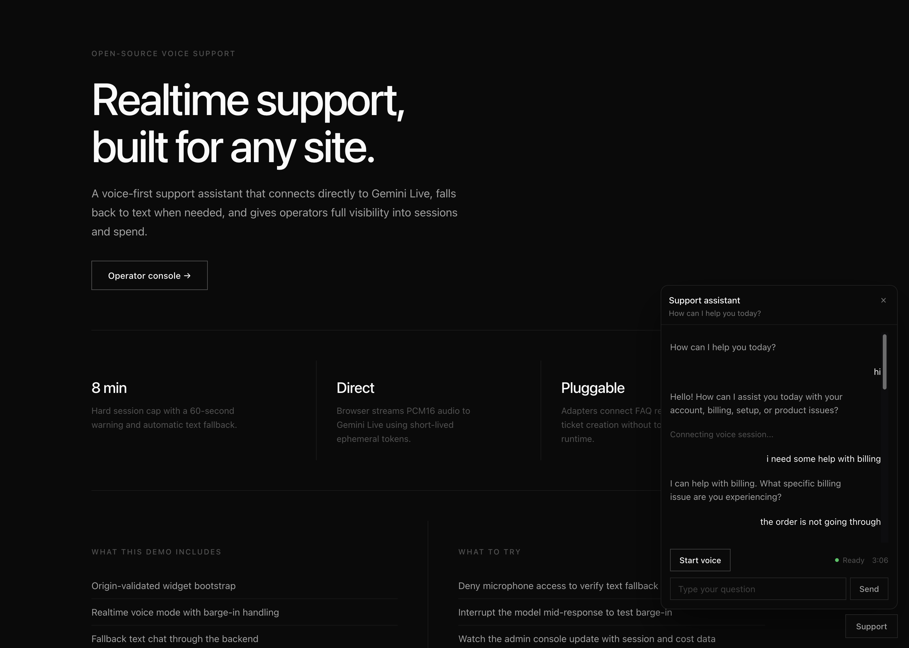
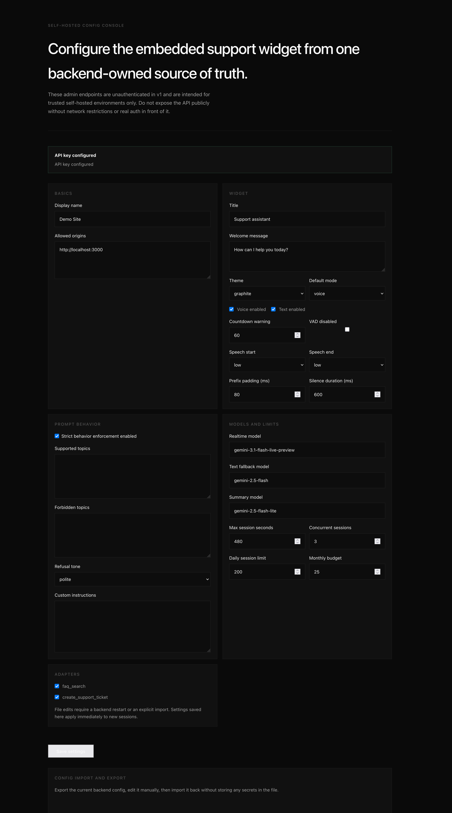
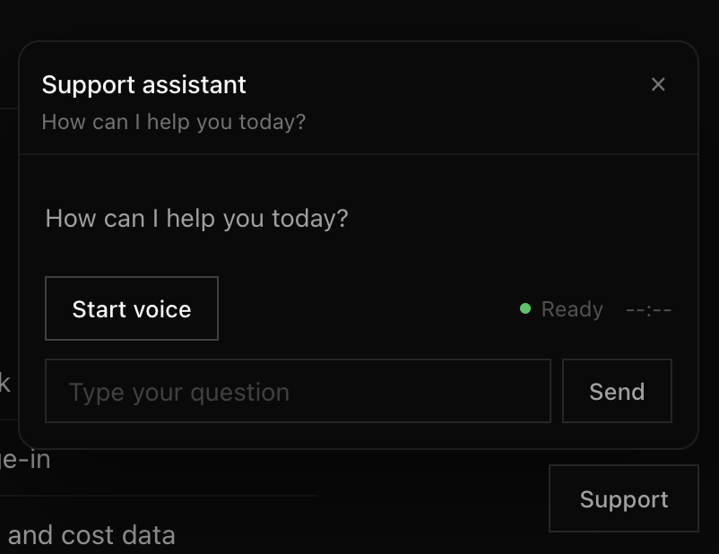

# OSS Realtime Voice Support Bot

A self-hostable support voicebot with:
- direct browser-to-Gemini Live audio
- FastAPI policy and tool backend
- embeddable widget
- Next.js demo site and operator console

This project is meant for teams that want to run their own customer support assistant on their own infrastructure, keep the Gemini API key on the backend, and embed a support widget into their product site without building the whole realtime stack from scratch. The included demo app works as both a reference integration and a local operator/config console for tuning prompts, modes, limits, knowledge, and widget appearance.

*The demo landing page shows the reference host site and the overall product framing for the embeddable support experience.*

*The admin console is where self-hosters configure allowed origins, widget behavior, prompt controls, limits, models, and knowledge.*

*The widget UI is the embeddable customer-facing support surface, with voice and text flows driven by backend settings.*

## Workspace
- `apps/demo`: sample site and operator console
- `packages/contracts`: shared schemas and types
- `packages/widget`: embeddable browser widget
- `services/api`: FastAPI backend

## Local setup
1. Start Postgres: `docker compose up -d`
2. Copy `services/api/.env.example` to `services/api/.env`
3. Install frontend deps: `npm install`
4. Install backend deps: `python3 -m venv .venv && source .venv/bin/activate && pip install -r services/api/requirements.txt`
5. Run API: `uvicorn app.main:app --reload --app-dir services/api`
6. Run demo: `npm run dev:demo`

## Security defaults
- Google API keys stay on the backend only.
- Widget sessions use short-lived JWTs plus Gemini ephemeral tokens.
- Widget bootstrap validates `Origin` against the configured site allowlist.

## Admin warning
- The v1 admin/settings endpoints are unauthenticated and intended for trusted self-hosted environments only.
- Do not expose the FastAPI port publicly without private networking, IP restrictions, or real auth in front of it.

## Config console
- `apps/demo` now acts as the default self-hosted config console for the seeded site.
- Backend runtime settings live in the database.
- `services/api/config/site.json` is the seed/import-export format for file-first users.
- Editing `site.json` requires a backend restart or an explicit import through the admin console/API.
- Gemini credentials still belong only in `services/api/.env` as `DEFAULT_GOOGLE_API_KEY`.

## CSP
Host pages embedding the widget should include:
- `connect-src` for your backend origin
- `connect-src` for `https://generativelanguage.googleapis.com` and the Live websocket endpoint

## Notes
- The widget uses Gemini Live over WebSockets with ephemeral tokens.
- Input audio is sent as PCM16 at 16kHz.
- Output audio is played back from 24kHz PCM chunks.
- Company-specific support content now lives per `site` in the backend `knowledge_entries` table.
- Integrators can import knowledge with `POST /admin/sites/{site_id}/knowledge` and inspect it with `GET /admin/sites/{site_id}/knowledge`.
- Strict behavior is enforced by a file-based policy plus a BAML moderation classifier in `services/api/baml_src`.
- Voice remains direct-to-Gemini Live, while final user turns are checked asynchronously through `POST /widget/sessions/{session_id}/turns`.
- The widget also opens an SSE control stream at `GET /widget/sessions/{session_id}/control-stream` for strike warnings and policy termination.
